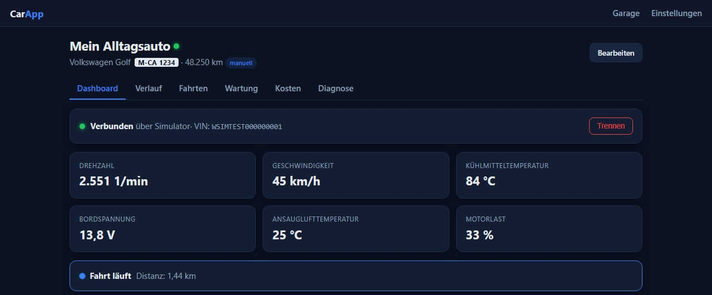

# ObdGarage

[](https://github.com/lukislp/ObdGarage/actions/workflows/ci-cd.yml)
[](https://github.com/lukislp/ObdGarage/releases)
[](LICENSE)
[](https://dotnet.microsoft.com/)
[](https://github.com/lukislp/ObdGarage/actions/workflows/ci-cd.yml)

A self-hosted, multi-user OBD2 vehicle tracker built with **Blazor Server** and **.NET MAUI**
(.NET 10). Each user manages their own vehicles — a strict one-owner model, nothing is shared —
connects over a standard ELM327 adapter (Bluetooth Classic, BLE, or Wi-Fi), and gets an
automatic trip log, a maintenance planner (inspection/emissions due dates), fuel cost tracking,
and full value-history charts out of the connection's live data.

The Web app is a fully working test bed for the UI while the mobile shell is built out: vehicle
cards (photo, odometer with source, inspection/service status), a live dashboard (simulator or
real Wi-Fi adapter), value-history charts, an automatic trip log with CSV export, a maintenance
planner, fuel/cost tracking, and sync against the self-hosted backend (invite-code registration,
offline-first, strict per-owner scoping).

> **Status:** functional MVP - backend, sync, and the full web UI are built and tested (all
> passing, see [Testing](#testing)) against a simulated vehicle. **Not yet validated against a
> real OBD2 adapter or vehicle**, and the mobile (MAUI) shell exists as source only. See
> [Roadmap](#roadmap).



## Features

- **Read-only by design.** `Elm327Client` enforces a strict command whitelist (SAE J1979 modes
  01/02/03/07/09 plus harmless `AT` commands). Clearing fault codes (Mode 04), UDS writes, and
  header spoofing (`ATSH`) are blocked at the transport layer, not just in the UI - see
  [Safety](#safety).
- **Automatic trip log** derived from live odometer/speed data, with CSV export.
- **DTC diagnostics**: read stored and pending fault codes (mode 03/07) with plain-text
  descriptions for common generic codes across all four categories (Powertrain/Chassis/Body/
  Network). Read-only, like everything else - clearing codes (mode 04) is permanently blocked.
- **Maintenance planner** for inspection and service intervals.
- **Fuel and cost tracking.**
- **Continuous value history**: every polled live value is stored as a sample (not just during
  trips), later compacted into per-minute min/avg/max aggregates.
- **Offline-first sync**: local data is the source of truth; the backend uses Last-Write-Wins
  with soft-delete tombstones. Every vehicle and its child entities are strictly scoped to their
  owning user, enforced server-side.
- **Multi-transport OBD**: Wi-Fi (TCP, e.g. `192.168.0.10:35000`) is implemented and tested
  against a full vehicle simulator; Bluetooth Classic (Android) and BLE (Android + iOS) are next.

## Architecture

```
UI (Blazor components)  →  Application services  →  Repositories (Core interfaces)
                                    ↓
                          Obd layer (Elm327Client, PID registry, transports)
```

- **UI is swappable.** Blazor components hold no logic or data access - they call
  `CarApp.Application` services, which use repository interfaces defined in `CarApp.Core`
  (implemented in `CarApp.Data`). Dependency direction is strict:
  `App/Web → Application/Data/Obd → Core`; `Core` depends on nothing.
- **Transport abstraction.** `IObdTransport` (connect/send/read/disconnect) is implemented by a
  Wi-Fi TCP transport, an Android Bluetooth Classic transport, and a full vehicle simulator used
  throughout the test suite - the OBD/PID parsing layer never talks to hardware directly.

### Safety

`Elm327Client` only ever sends whitelisted read commands. Fault-code clearing, UDS writes, and
adapter header spoofing are rejected before they reach the transport, enforced by
`CommandWhitelistTests` in the core test suite - this is a hard invariant, not a UI-level
courtesy.

## Project structure

| Project | Purpose |
|---|---|
| `src/CarApp.Core` | Domain models + interfaces, dependency-free |
| `src/CarApp.Obd` | ELM327 client (read-only whitelist), PID registry, transports (Wi-Fi done; Android Bluetooth lives in `CarApp.App`), vehicle simulator |
| `src/CarApp.Application` | `LiveDataService` (polling + gap-free value history), `TripRecorder`, `OdometerTracker`, `MaintenanceCalculator`, `FuelStatistics`, `SyncService` |
| `src/CarApp.Data` | EF Core/SQLite persistence behind the `Core` interfaces (one `carapp.db` per data directory; earlier per-entity JSON files are imported automatically on first run) |
| `src/CarApp.Server` | Backend: accounts (PBKDF2), hashed bearer tokens, Last-Write-Wins sync API, samples API |
| `src/CarApp.Shared` | DTOs shared between app and backend |
| `src/CarApp.Web` | Full UI, Blazor Interactive Server, no external JS dependencies |
| `src/CarApp.App` | .NET MAUI shell (Android/iOS) incl. Android Bluetooth Classic transport - source only, needs the MAUI workload, not part of the solution file |
| `tests/CarApp.Tests` | xUnit - OBD core (PID/DTC decoding, whitelist, client behavior), EF Core/SQLite persistence, and regression coverage for bugs found across the app |
| `tools/CarApp.TestRunner` | Full application/E2E/sync suite, dependency-free (compiles without NuGet) |

## Getting started

Requires the .NET 10 SDK.

```bash
# 1. Full test suite (113 checks, including end-to-end with a vehicle simulator + sync roundtrips)
dotnet run --project tools/CarApp.TestRunner

# 2. Start the backend (invite code defaults to CARAPP-2026)
ASPNETCORE_URLS=http://0.0.0.0:5299 dotnet run --project src/CarApp.Server --no-launch-profile

# 3. Start the web app and open it in a browser
ASPNETCORE_URLS=http://127.0.0.1:5199 dotnet run --project src/CarApp.Web --no-launch-profile
# → http://127.0.0.1:5199  (Garage → add vehicle → dashboard → "connect simulator")
```

`src/CarApp.Web/launchSettings.json` overrides `ASPNETCORE_URLS`, so `--no-launch-profile` is
required for the commands above to take effect.

## Deployment

Multi-arch (`linux/amd64` + `linux/arm64`) images for both the backend and the web app are built
and pushed to GHCR on every release:

```bash
docker run -d -p 5299:5299 -v obdgarage-server-data:/data \
  -e InviteCode=your-invite-code \
  ghcr.io/lukislp/obdgarage-server:latest

docker run -d -p 5199:5199 -v obdgarage-web-data:/app/data \
  ghcr.io/lukislp/obdgarage-web:latest
```

`docker/server.Dockerfile` and `docker/web.Dockerfile` build from the repo root (both images
share several projects). The backend's `InviteCode` defaults to `CARAPP-2026` if unset - override
it for anything beyond local testing. Neither container currently persists its ASP.NET Core Data
Protection key ring to a volume, so authentication cookies are invalidated on every container
restart; mount `/home/app/.aspnet/DataProtection-Keys` (or configure
`PersistKeysToFileSystem`/an external key ring) before relying on long-lived sessions in
production.

## Testing

Two complementary suites:

- **`tools/CarApp.TestRunner`** (113 checks) - the primary suite. Dependency-free by design (this
  project originated in an environment without NuGet access), covering the full stack: OBD
  parsing (including DTC reading), application services, persistence, and end-to-end sync
  roundtrips between multiple simulated devices and the real backend (ownership isolation,
  Last-Write-Wins conflicts, soft-delete tombstones, sample push/query scoping), plus a
  security-focused pass (login timing side-channel, rejected-push retry behavior).
- **`tests/CarApp.Tests`** (65 tests, xUnit) - OBD core (PID/DTC decoding against real SAE
  J1979/J2012 byte responses, the read-only command whitelist, `Elm327Client` behavior against a
  scripted transport) plus regression coverage for bugs found across the application, persistence
  (including the EF Core/SQLite repositories and the JSON→SQLite upgrade importer), and web UI
  layers.

Both run in CI on every push and pull request, alongside a solution build and a
`dotnet format --verify-no-changes` lint check. Docker images are only built and published after
all of these pass.

## Roadmap

- [ ] Build the MAUI shell for Android/iOS (workload install, add to the solution, test on a
      real device) - currently shows a placeholder view.
- [ ] Extract the Web UI into a shared Razor Class Library so MAUI gets the same interactivity
      as the Web app.
- [x] Switch persistence from JSON to EF Core + SQLite (only `CarApp.Data` changed - the
      repository interfaces stayed the same). Existing per-entity JSON data from before the
      switch is imported automatically on first startup against a given data directory.
- [ ] Implement the BLE transport (skeleton exists; iOS can only use BLE or Wi-Fi, not Bluetooth
      Classic).
- [ ] Validate against a real ELM327 adapter and vehicle - everything so far has run against the
      built-in simulator.
- [x] DTC diagnostics (read stored/pending fault codes with plain-text descriptions for common
      generic codes). Clearing codes (Mode 04) stays permanently blocked - no product decision
      changed that; this app only ever reads.
- [ ] Harden the backend for access outside the home network (reverse proxy with HTTPS, or
      WireGuard/Tailscale).

## License

AGPL-3.0. See [LICENSE](LICENSE).
